# Day-Ahead Load and Solar Forecasting

[](https://www.python.org/)
[](LICENSE)

A reproducible research baseline for **24-hour-ahead microgrid load and solar
forecasting**. It provides leakage-aware feature engineering, purged rolling-origin
backtesting, configuration-driven experiments, model selection, and serialization.

The bundled data is synthetic. Results demonstrate that the software works; they
do not establish real-world grid performance.

## Pipeline

```mermaid
flowchart LR
    A["Hourly load, solar, weather"] --> B["Availability-aware features"]
    B --> C["Final holdout isolation"]
    C --> D["Purged rolling-origin folds"]
    D --> E["Persistence + candidate models"]
    E --> F["Select by mean CV RMSE"]
    F --> G["Refit on development period"]
    G --> H["Evaluate final holdout"]
    H --> I["Metrics, predictions, saved models"]
```



## Quick start

```bash
python -m venv .venv
# Windows PowerShell:
.venv\Scripts\Activate.ps1
pip install -r requirements.txt -r requirements-dev.txt
python run_experiment.py --config configs/baseline.yaml
```

In the monorepo layout, use `python run_experiment.py` or the installed package
entry points instead of the old root-level compatibility wrapper.

## What the baseline does

- Generates two years of hourly load, solar, and temperature data.
- Can also load validated hourly CSV data through configuration.
- Predicts both load and solar at a defined 24-hour horizon.
- Uses future-known calendar/weather covariates and only target measurements that
  would be available when the forecast is issued.
- Includes lagged net load without leaking contemporaneous load or solar values.
- Provides optional longer historical lags and rolling summaries shifted to the
  forecast issue time.
- Compares linear regression, ridge regression, and random forest against
  same-hour persistence.
- Selects models using multiple rolling-origin folds.
- Keeps a final 30-day test period untouched until model selection is complete.
- Saves fitted scikit-learn pipelines with `joblib`.

The default configuration is [configs/baseline.yaml](configs/baseline.yaml). Change
model parameters, fold sizes, or output paths there instead of editing Python.

[configs/enhanced_history.yaml](configs/enhanced_history.yaml) enables the
optional extended history feature set for comparison.

## Why the cross-validation gap is 24

For the first timestamp in a validation fold, a day-ahead forecast would have been
issued 24 hours earlier. A 24-row purge prevents training on target labels that
would not yet have been observed at that forecast origin. Using `gap: 0` would make
the backtest look cleaner than deployment reality.

Every fold receives a newly constructed estimator. The linear model's scaler lives
inside its pipeline, so it is fitted using that fold's training rows only.

When enabled, rolling features follow the same availability rule. For a target
timestamp `t` and a 24-hour horizon, a rolling mean uses measurements ending at
`t-24`, not measurements from `t-23` through `t-1`.

## Outputs

The default run writes to `outputs/baseline/`:

- `cross_validation_metrics.csv` — per-fold MAE, RMSE, and R²
- `final_test_metrics.csv` — selected-model and persistence holdout scores
- `final_test_predictions.csv` — actual, predicted, and persistence values
- `models/*.joblib` — fitted load and solar pipelines
- `resolved_config.yaml` — exact experiment configuration
- `summary.json` — selected models and run metadata

## Optional Time2Vec-LSTM

The repository includes an optional, corrected neural architecture in
`src/energy_forecasting/layers.py` and `src/energy_forecasting/neural.py`.

Unlike the original proposal, it:

- sends only a scalar time channel through Time2Vec;
- sends historical measurements through a separate feature input;
- uses Keras' Functional API to merge the inputs;
- creates a fresh serializable custom layer;
- rejects embeddings with no periodic component; and
- emits all 24 forecast steps rather than a single value.

Install the optional dependency with:

```bash
pip install -r requirements-deep-learning.txt
```

`configs/lstm_time2vec.example.yaml` records suitable starting parameters, but is
deliberately not named “best model.” A sequential data loader, per-fold scaling,
early stopping, and evaluation on real data should be completed before claiming
that a neural model outperforms the tabular baseline.

## Repository layout

```text
configs/                         Experiment definitions
src/energy_forecasting/data.py  Synthetic generation and CSV loading
src/energy_forecasting/features.py
                                 Leakage-aware feature creation
src/energy_forecasting/evaluation.py
                                 Purged rolling-origin evaluation
src/energy_forecasting/models.py Tabular model factories
src/energy_forecasting/layers.py Optional serializable Time2Vec layer
src/energy_forecasting/neural.py Optional two-input LSTM model
src/energy_forecasting/experiment.py
                                 End-to-end configured experiment
tests/                           Feature, config, and evaluation tests
```

## Using Real Data

Set `data.source` to `csv` and provide `data.path` in a config file:

```yaml
data:
  source: "csv"
  path: "data/my_hourly_microgrid.csv"
  forecast_horizon: 24
```

The CSV loader validates required columns, parses timestamps, sorts rows, rejects
duplicate timestamps, rejects missing hourly intervals, and rejects negative load
or solar target values. The file must contain these columns:

| Column | Meaning |
|---|---|
| `timestamp` | Target-hour timestamp with an explicit timezone |
| `load_kw` | Mean load during the hour |
| `solar_kw` | Mean PV generation during the hour |
| `temperature_c` | Weather forecast available at least 24 hours earlier |

Production work must also define daylight-saving handling, outlier policy, units,
forecast issue timestamps, weather-vintage selection, and data licences. Solar
zenith, GHI, clear-sky index, cloud cover, and public-holiday flags become
valuable once genuine location and weather data are available.

## Tests

```bash
pip install -r requirements-dev.txt
python -m pytest -q
```

Tests verify lag alignment, data-loader validation, duplicate-timestamp rejection,
purge gaps, fresh models per fold, pandas-safe indexing, configuration safety, and
metric-shape handling.

## License

MIT. See [LICENSE](LICENSE).
